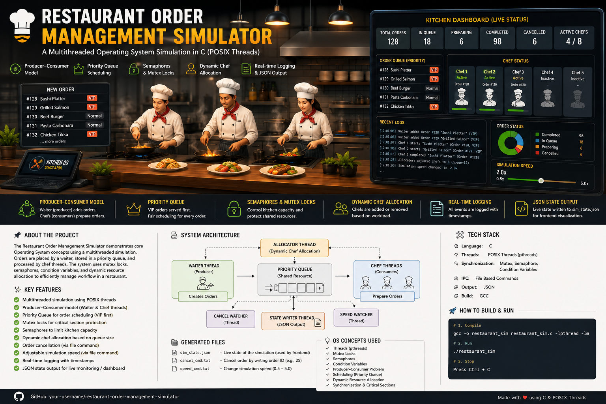

<h1 align="center">
  🍽️ Restaurant Order Management Simulator
</h1>

<p align="center">
  
</p>

<p align="center">
  A Multithreaded Operating System Simulation using C & POSIX Threads
</p>

<p align="center">
  
  
  
  
  
</p>

---

# 📌 Overview

The **Restaurant Order Management Simulator** is a real-time Operating Systems project developed in **C** using:

- POSIX Threads (`pthread`)
- Mutex Locks
- Semaphores
- Condition Variables
- Priority Scheduling
- Dynamic Resource Allocation

The simulator models a real-world restaurant environment where:

✅ Customers place orders concurrently  
✅ Waiters generate requests  
✅ Chefs prepare food simultaneously  
✅ VIP customers receive higher priority  
✅ Kitchen resources are synchronized safely  
✅ Live system state is exported in JSON format  

---

# 🚀 Features

## 🍕 Core Functionalities

- 👨‍🍳 Multithreaded chef processing
- 🧾 Dynamic customer order generation
- ⭐ VIP order priority scheduling
- 🔒 Mutex-based synchronization
- 🚦 Semaphore-controlled kitchen access
- 📦 Producer-Consumer implementation
- ⚡ Adjustable simulation speed
- ❌ Live order cancellation support
- 📊 Real-time JSON state output
- 📈 Dynamic chef scaling
- 📝 Thread-safe logging system

---

# 🧠 Operating System Concepts Used

| Concept | Implementation |
|---|---|
| Producer-Consumer Problem | Waiter & Chef Threads |
| Multithreading | POSIX Threads (`pthread`) |
| Mutex Locks | Shared queue protection |
| Semaphores | Kitchen concurrency control |
| Condition Variables | Queue synchronization |
| Priority Scheduling | VIP order handling |
| Critical Section | Shared state protection |
| Dynamic Resource Allocation | Auto chef scaling |
| Synchronization | Mutex + Semaphore |

---

# 🏗️ System Architecture

```text
                    +----------------+
                    |   Customers    |
                    +----------------+
                             |
                             v
                    +----------------+
                    | Waiter Thread  |
                    |   (Producer)   |
                    +----------------+
                             |
                             v
                 +----------------------+
                 | Priority Order Queue |
                 +----------------------+
                             |
               +-------------+-------------+
               |             |             |
               v             v             v
        +-----------+ +-----------+ +-----------+
        |  Chef 1   | |  Chef 2   | |  Chef N   |
        +-----------+ +-----------+ +-----------+
               \             |             /
                \            |            /
                 +----------------------+
                 |  Kitchen Semaphore   |
                 +----------------------+
                             |
                             v
                    +----------------+
                    | Completed Food |
                    +----------------+
                             |
                             v
                    +----------------+
                    | JSON State File|
                    +----------------+
```

---

# 📂 Project Structure

```text
Restaurant-Order-Management-Simulator/
│
├── restaurant_sim.c
├── sim_state.json
├── cancel_cmd.txt
├── speed_cmd.txt
├── image.png
├── README.md
└── assets/
```

---

# ⚙️ Build & Run

## 🔨 Compile

```bash
gcc -o restaurant_sim restaurant_sim.c -lpthread -lm
```

## ▶️ Run

```bash
./restaurant_sim
```

---

# 📊 Example Output

```text
=== Restaurant Order Management Simulator ===
Chefs: 2 (dynamic), Queue capacity: 50
Writing state to: sim_state.json
Press Ctrl+C to stop.

[Summary] Total=15 Queue=3 Cooking=2 Done=10 Cancelled=0 Chefs=3
```

---

# 🔄 Workflow

```text
Customer Places Order
          ↓
Waiter Thread Creates Order
          ↓
Order Added to Priority Queue
          ↓
Chef Thread Fetches Order
          ↓
Semaphore Grants Kitchen Access
          ↓
Food Preparation Begins
          ↓
Order Completed
          ↓
JSON State Updated
```

---

# 🔐 Synchronization Mechanisms

## 🔒 Mutex Locks

Used to:

- Protect shared queues
- Prevent race conditions
- Synchronize shared states
- Secure logging operations

## 🚦 Semaphores

Used to:

- Limit active chefs
- Control kitchen capacity
- Manage concurrent access

## 🔔 Condition Variables

Used to:

- Wake chefs when orders arrive
- Pause waiter when queue is full

---

# ⭐ Priority Scheduling

The simulator implements a **Priority Queue (Max Heap)**.

### Scheduling Rules

- VIP orders processed first
- Older orders processed earlier within same priority

---

# 📈 Dynamic Chef Allocation

The simulator automatically adjusts active chefs based on workload.

| Queue Size | Action |
|---|---|
| Queue > 10 | Add Chef |
| Queue < 3 | Remove Chef |

This demonstrates:

- Adaptive resource management
- Dynamic thread allocation
- Load balancing

---

# 📜 JSON State Output

The simulator continuously writes live data to:

```text
sim_state.json
```

The JSON file contains:

- Active orders
- Queue status
- Chef activity
- Logs
- Simulation speed
- Timestamps

Useful for:

- Web dashboards
- Real-time monitoring
- Data visualization

---

# 🧪 Testing Scenarios

The simulator was tested for:

- High concurrent workloads
- Queue overflow handling
- Synchronization correctness
- Dynamic speed changes
- Multiple active chefs
- Resource conflict prevention

---

# 📚 Learning Outcomes

This project provides practical understanding of:

- Thread synchronization
- Concurrent programming
- Producer-Consumer Problem
- Mutexes & Semaphores
- Scheduling algorithms
- Shared resource protection
- Real-time system simulation

---

# 👨‍💻 Team Members

| Name | Roll Number |
|---|---|
| Muhammad Adil Saeed | 24K-0705 |
| Harsh Kumar | 24K-0912 |
| Muhammad Haseem Samo | 24K-0666 |

---

# 👨‍🏫 Course Information

| Field | Details |
|---|---|
| Course | Operating Systems |
| Instructor | Mr Ubaidullah |
| University | FAST-NUCES Karachi |

---

# 📖 References

- Operating System Concepts — Silberschatz
- POSIX Threads Documentation
- Linux Semaphore Documentation
- GCC Compiler Documentation
- FAST-NUCES Operating Systems Course Material

---

# 🌟 Highlights

✅ Real-world OS simulation  
✅ Advanced synchronization mechanisms  
✅ Dynamic thread management  
✅ Priority scheduling implementation  
✅ Thread-safe architecture  
✅ Live JSON state monitoring  

---

<p align="center">
  <b>Restaurant Order Management Simulator</b><br>
  Operating Systems Project • FAST-NUCES Karachi
</p>
